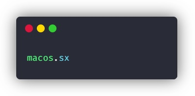

<h1 align="center">

</h1>

<h3 align="center">
Share your stylish snippets with the world!
</h3>

## Overview

[macos.sx](https://macode.now.sh) is a open source platform to create, share and embed beatiful code snippets.

## Key features

 - 🖼️ Instant screenshot (save local or to clipboard)
 - 📄 Embed snippets
 - 💅 Customize theme and background
 - 🏃‍♀️ Dynamic import of languages
 - 👩‍💻 Share on social media (Twitter, Slack, ...)
